  <picture>
    <source media="(prefers-color-scheme: dark)" srcset="assets/terminal-dark.svg" />
    
  </picture>

  <a href="https://mukhtarsani.vercel.app"><code>portfolio</code></a> &nbsp;
  <a href="mailto:mukhtaar.abdulkarim@gmail.com"><code>email</code></a> &nbsp;
  <a href="https://x.com/MukhtaarAbdul"><code>x</code></a>

